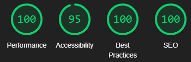

# JMN Suppression

**[Live site](https://erykslezak.github.io/CIPP1/)**

---

## Index

- <a href="#context">Context</a>
- <a href="#ux">UX</a>
  - <a href="#ux-stories">User stories</a>
  - <a href="#ux-wireframes">Wireframes</a>
  - <a href="#ux-theme">Theme</a>
- <a href="#features">Features</a>
  - <a href="#features-all">Site wide</a>
  - <a href="#features-pages">Pages</a>
  - <a href="#features-forms">Forms</a>
  - <a href="#features-future">Still to implement</a>
- <a href="#technologies">Technologies Used</a>
- <a href="#testing">Testing</a>
  - <a href="#testing-auto">Automated</a>
  - <a href="#testing-manual">Manual</a>
  - <a href="#testing-responsive">Responsiveness</a>
  - <a href="#testing-resolved">Resolved issues</a>
  - <a href="#testing-unresolved">Unresolved issues</a>
  - <a href="#testing-bugs">Known bugs</a>
- <a href="#deployment">Deployment</a>
- <a href="#credits">Credits</a>

---

## Context

JMN Suppression is a fire suppression company that designs, install and maintain all type of fire systems but mainly focus on suppression systems. The focus of this project is to bring their services closer to potential customers by providing detailed information on each of the 'our services' pages.

<a style="text-align:right" href="#top">Go to index :arrow_double_up:</a>

## UX

### Overview

The site is presented in a minimalist but effective way, providing all the information the user would ever need. Users can find out more about the JMN Company, services they provide, products they use and contact them using different forms depending on the users needs.

### User stories

### User stories

For ease of reference, the means by which a user's expectations have been met are summarised in the tables below:

| As a **client** I want | How this is achieved                                                                                                                                                           
| :-------------------------------------------------------------------------------------------------------------------------------------------------------- | :---------------------------------------------------------------------------------------------------------------------------------------------------------------------------------------------------------------------------------------------------------------------------------------------------------------------------------------------------------------------------------------------------------------------------------------------------------------------------------------------------------------------------------------------------------------------- |
| Visitors to be immediately aware of what the product is                                                                                                   | The logo, information on homepage and the picture provided make it immediately clear what the product is.                                                                                                                                                                |
| Visitors to be able to send in their queries through different forms depending of their needs | The three forms that are accessible through the navbar as well as info bar let users choose the way they want to contact the client.   The contact, free site survey and quotation forms let client choose who they want to forward submissions to and be able to adjust the forms to their needs without affecting the other ones.                            |                                                                                                                                                           
| A clean, consistent interface which will not confuse visitors                                                                                             | The header consisting of infobar and navbar, footer, page bar with title and breadcrumbs of each page are simple and consistent. The typography, spacing, image styling and colours match together well to give visitors clear readability. All links have consistent visual feedback, including the hover effect on the menu.

| As a **visitor** I want                                                                                                                                                               | How this is achieved                                                                                                                                                                                                                                                                                                                            
| :------------------------------------------------------------------------------------------------------------------------------------------------------------------------------------ | :--------------------------------------------------------------------------------------------------------------------------------------------------------------------------------------------------------------------------------------------------------------------------------------------------------------------------------------------------- |
| To learn something about the company and to be able to contact them directly                                                                        | The About Us page is separate from the rest. It is easily accessible through the navbar for those wishing to learn more about the company and what type of other services they provide.  The About page includes short description of who JMN are, a link which brings user to contact us page in order for them to get more information if needed and footer provides JMN address if visitor wishes to visit them directly.|
| To be able to find out more about the services, specifically what products is client using for his services.                                                                                   | Hovering over 'Our Services' will give visitor a subnav of 3 other options containing the process of designing, installing and maintaining suppression systems.  Products are on a separate page and provides two most commonly used gas systems and most used panel to accompany the system.                                                                                                                                                            
| For it to be immediately clear what the purpose of the site is and what it has to offer. The interface and layout should be clean, with a focus on services. | Aligns with client's expectations 
| To be able to access all information on a range of devices                                                                                                                            | This is addressed in the <a href="#testing-responsive">Responsiveness</a> section below                                                                                                                                                              
| Site and images to be fast to load                                                                                                                           | Reduction of file sizes have been made for the site to load faster. All done without impacting page quality. E                      |

### Wireframes

The wireframes were successfully converted into a live functioning website, however for mobile the text and images are not ordered as the website/tablet. This to be changed in future.

The full suite of wireframes for **desktop**, **tablet** and **mobile** devices, plus a **sitemap**, can be accessed [here](wireframes/).

### Site theme

Based on the client's brief expectations for the site, a clean, clear and simple aesthetic has been implemented. 

Two fonts with a soft, dynamic style have been used throughout the whole site: [PT Sans](https://fonts.google.com/specimen/PT+Sans) and [Antic Slab](https://fonts.google.com/specimen/Antic+Slab).

The site theme was chosen based on client's logo that was provided, bright colors were decided to be used. The infobar being #4da558 to complement the logo, for footer decision was to go more dark to not have completely bright site which in that case we have used two darker shades being #363839 and #282A2B for copyright part of footer. The text has different colors depending on it's background, the same goes for links across the site.

<a style="text-align:right" href="#top">Go to index :arrow_double_up:</a>

## Features

### Sitewide

**1. Infobar**

- Infobar has been divided into two sections to keep contact and forms separate.
- Contact side of infobar is linked to both phone and email, for either straight mobile call or mail being created in default mail app.
- Quote side of infobar is linked to different forms for visitor to contact the right department of client's company.
- For mobile browsing the infobar size has been increased vertically keeping all options for visitor useable.

**2. Navbar**
- Design has been modified to vertical menu for mobile browsing.
- Dropdown menu has been added to separate services pages and is accessible from all devices.
- Logo's size is decreased for mobile and subnav menu position moved when hovered over the logo.
- Hover effect on all menu selections is bright green matching infobar. Transition has been implemented to add some animations onto site.
- Bottom border of navbar has been created to separate all pages from it with a subtle grey color.

**3. Footer**

- Footer has been divided into 3 sections which consist of logo, menu, location and contact details.
- Separate section of footer has been added for copyright.
- Footer is always positioned at the bottom of the site. For mobile footer has been increased vertically keeping all sections of it ordered.
- Menu as contact details are both linked bringing back the bright green colors of infobar.

### Pages

- All pages across the site have fixed width.
- A section bar has been added that divides header and page. Home page being only one without it.
- Section bar consits of pages title and breadcrumbs aligned left and right.

**4. Home page**

- An imagee of gas bottles to let visitor know straight away what client's services are.
- Text introducing JMN Suppression to the visitor.

**5. About Us page**

- More information about client's company such as their history, partners and more.
- Link to contact us page.

**6. Design page**

- Page consits of information on how the designing process of fire suppression works describing steps taken.

**7. Installation & Maintenance page**

- An image showing requirements in order to have a safety site.
- FAQ style page describing different type of suppression systems, information regarding commissioning and installation.

**8. Room Integrity Testing page**

- FAQ style page with images beside the paragraphs.
- Information on what type of suppression systems needs that sort of procedure and why is it important.

**9. Our Products page**

- Gives visitor insight of what is our most commonly used system and type of gas.
- Images as well as product names are linked to the manufacturers.

**10. Contact Us page**

- Top of page is divided into two sections. Left containing client's logo and address with contact details. Right containing embedded google maps with address of client's office.
- Contact Us form.

### Forms

**11. Free Site Survey form**

- Page with a form for visitors to complete in order for client's company to book in a free site survey.

**12. Quotation form**

- Page with a form for visitors to complete in order for client's company to give potentialy a new customer quotation for his/her site.

### Features left to implement

- Online payment form

  _Area has been designed in infobar. Form yet to bo completed with possible stripe integration._

- 'Hamburger' menu for mobile

  _As of now, mobile has a vertical style menu with a sub nav menu displaying over logo if 'our services' section has been hovered over._

- Order of divs on certain pages

  _e.g. For mobile some picture are above the mentioned text and are meant to be under._

- Live chat integration

  _A pop up live chat notification could possibly bring more customers in as visitor would get their answers straight away_

<a style="text-align:right" href="#top">Go to index :arrow_double_up:</a>

## Technologies Used

### Languages

- HTML
- CSS

### Project management

- [GitHub](https://github.com/) - Version control and deployment
- [GitPod](https://gitpod.io/) - IDE used to code the site
- [Balsamiq](https://balsamiq.com/wireframes/) - Wireframe creation app

### Style and theme

- [Font Awesome](https://fontawesome.com/) - Icon used for menu in footer
- [Google Fonts](https://fonts.google.com/) - PT Sans and Antic Slab fonts
- [Free Formatter](https://www.freeformatter.com/html-formatter.html) - Used for formatting HTML code

### Image manipulation

- [ImageOptim](https://imageoptim.com/mac) - App used for cropping and reducing file size of images

### Online resources

- [Stack Overflow](https://stackoverflow.com/)
- [W3 Schools](https://www.w3schools.com/)

<a style="text-align:right" href="#top">Go to index :arrow_double_up:</a>

## Testing

### Automated testing

- [Chrome DevTools](https://developers.google.com/web/tools/chrome-devtools) - Ran an audit using lighthouse on all pages for both desktop and mobile.

Summary and Scores:

- All pages have accessibility scores lowered due to `Background and foreground colors do not have a sufficient contrast ratio.`.
- Pages containing section bar have also accessibility scores lowered due to breadcrumbs heading being not in a sequentially-descending order.
- Few mobile issues such as tag `a.active` overlaps other menu causing lower SEO score.
- Some images also do not have explicit width and height and display with incorrect aspect ratio.
- Performance also throws errors due to images being png/jpeg.

 

### Home:

### About Us:

### Design:

### Installation & Maintenance:

### Room Integrity Testing:

### Our Products:

### Contact Us:

### Free Site Survey:

### Quotation Details:

Desktop scores

 

### Home:

### About Us:

### Design:

### Installation & Maintenance:

### Room Integrity Testing:

### Our Products:

### Contact Us:

### Free Site Survey:

### Quotation Details:

Mobile scores

 

- [W3C - HTML](https://validator.w3.org/) - No errors or warnings detected - **PASS**

- [W3C - CSS](https://jigsaw.w3.org/css-validator/) - No errors or warnings detected - **PASS**

- [CSS Lint](http://csslint.net/) - CSS lint found 0 errors and 105 warnings. - **PASS**
  - Don't use IDs in selectors